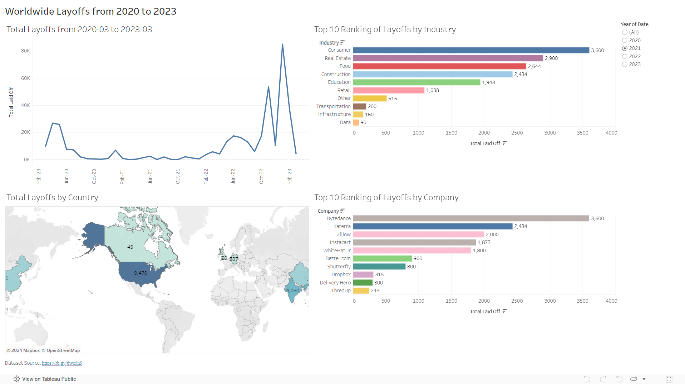

# Exploratory Data Analysis on Layoffs Dataset

## Table of Contents
  - [Objective](#objective)
  - [Dataset](#dataset)
  - [Tools](#tools)
  - [Methodology](#methodology)
  
### Objective

The primary goal of this project is to perform an exploratory data analysis (EDA) on the Layoffs dataset to uncover patterns, trends, and insights.

### Dataset

The dataset of layoffs from March 2020 to March 2023 (https://rb.gy/6we5n5) contains the following key features:

- Company: Name of the company
- Location: Location of the company
- Industry: Industry of the company
- Total Laid off: Total of employees laid off
- Percentage Laid off: Percentage of laid off respects to the total of employees
- Date: date of the laid-off
- Stage: Business phase or funding stage the company is in
- Country: Country of the company
- Funds Raised Millions: Amount of capital the company has raised from investors in millions of dollars

### Tools
- SQL for exploratory data analysis.
- Tableau for data visualization.

### Methodology

#### 1. Data Collection and Preparation

The data cleaning was done in the [Layoffs Data Cleaning Project](https://github.com/galaes/layoffs-data-cleaning/blob/3c1c60ecad47e0939bf8d2c2489d68079a5c21eb/README.md), which includes:
- Data loading and inspection
- Handling missing and duplicate values
- Standardizing the structure of the data   

#### 2. Descriptive Analysis

The analysis includes answers to questions such as:
- What was the total laid off for each year and month?

```sql
WITH Rolling_Total AS
(
SELECT SUBSTRING(`date`, 1,7) AS `MONTH`, SUM(total_laid_off) AS total_off
FROM layoffs_staging2
WHERE SUBSTRING(`date`, 1,7) IS NOT NULL
GROUP BY `MONTH`
ORDER BY `MONTH` ASC
)
SELECT `MONTH`, total_off,
SUM(total_off) OVER(ORDER BY `MONTH`) AS rolling_total
FROM Rolling_Total;
```

  
- What was the top 5 ranking of laid-off for each year?

```sql
WITH Company_Year (company, years, total_laid_off) AS
(
SELECT company, YEAR(`date`), SUM(total_laid_off) 
FROM layoffs_staging2
GROUP BY company, YEAR(`date`)
), Company_Year_Rank AS
(SELECT *, 
DENSE_RANK() OVER (PARTITION BY years ORDER BY total_laid_off DESC) AS Ranking
FROM Company_Year
WHERE years IS NOT NULL
)
SELECT *
FROM Company_Year_Rank
WHERE Ranking <= 5
;
```


- [SQL Data Exploration Analysis](https://github.com/galaes/Layoffs-exploratory-data-analysis/blob/5c4220d79d1b81889677e050b667cb8d9a120657/Data%20Exploratory%20Analysis-%20Layoffs%20dataset.sql)

#### 3. Data Visualization

[Dashboard Tableau](https://public.tableau.com/views/WordlwideLayoffsfrom2020-2023/Dashboard1?:language=en-US&:sid=&:redirect=auth&:display_count=n&:origin=viz_share_link)



#### 4. Insights and Findings

- The highest peaks of total worldwide layoffs between March 2020 and March 2023 were in November 2022, with 53,451, and in January 2023, with 84,714.
- The consumer industry was the hardest hit for the period under study, with 45,182 layoffs, followed by the retail sector with 43,613 layoffs.
- Amazon, Google, and Meta were the top three companies with the most layoffs globally, with 18, 150, 12,000, and 11,000, respectively.
- This explains why the United States has the highest number of layoffs in the world, with 256,059 total layoffs between March 2020 and 2023.
